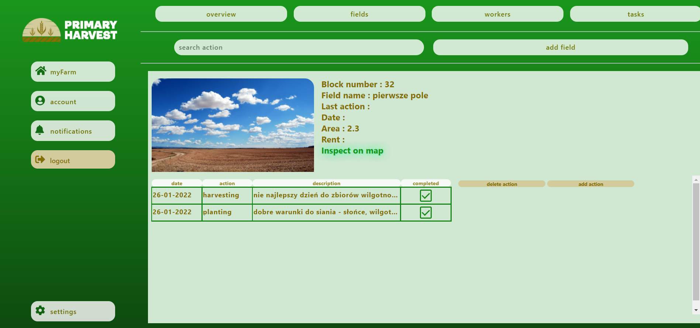

# Disclaimer - This is my project created during a subject on my university.It is written in a way so it meets the requirements.   Requirements can be seen here : https://ii.pk.edu.pl/~awidlak/content/25

Previously the repo was created on bitbucket since it was a required however I decided to move it to my github.

## Farm Management System

Farm Management System to system pomagający w zarządzaniu i organizacji pracy w gospodarstwie rolnym. W przyszłości
aplikacja może zostać rozbudowana by wspierać również inne typy gospodarstw np. gospodarstwa specjalizujące się 
w sadownictwie bądź hodowli zwierząt.

## Opis

* Głównym założeniem aplikacji podczas jej tworzenia była prostota w użytkowaniu.Wymaganie to wynika z uwagi na to, że 
w takich gospodarstwach często osoba pracująca nie ma czasu na staranne dokumentowanie wszystkich działań.Z kolei 
dokumentowanie swoich działań jest rzeczą bardzo istotną w każdym większym gospodarstwie, pozwala kontrolować działania 
i ułatwia podejmowanie decyzji które trzeba zaplanować wyprzedzeniem.  
* Interfejs aplikacji został właśnie tak stworzony by był bardzo prosty w użyciu, przejrzysty - by nawet starsi 
użytkownicy mogli się w niej łatwo odnaleźć.Za sprawą dosłownie paru kliknięć umożliwia dodawanie własnych akcji bądź innych działań.  
* Aplikacja wymaga tak naprawde od użytkownika jedynie utworzenia konta oraz założenia własnego gospodarstwa lub 
przyłączenie się do istniejącego gospodarstwa gdy jest się np. pracownikiem w czyimś gospodarstwie po wypełnieniu tych 
kroków można juz korzystać z funkcjonalności aplikacji.

## Aplikacja

* Na stronie logowania użytkownik może się zalogować bądź  zarejestrować.

* Każda strona zawierająca formularz informuje usera u wymaganiu podania danych poprzez  zaznaczanie kolejnych luk na czerwono.

po  zarejestrowaniu się użytkownik zostaje przekierowany do penelu logowania.

po zalogowaniu  się użytkownik zostanie przekierowany by wybrać swoją farmę - gdy jest pracownikiem bądź utworzyć własną.
 

po wpisaniu poprawnego kodu do dołączenia farmy użytkownik zostanie do niej dodany i przekierowany 
do głównego widoku swojego profilu. 
  
teraz dzięki prostej nawigacji u góry strony oraz po lewej może w prosty sposób korzystać z kolejnych funkcjonalności aplikacji.
 
Może sprawdzić kto pracuje razem z nim na gospodarstwie klikając przycisk "workers"

lub przejść do panelu kontroli zadań na farmie klikając "tasks"

Użytkownik może dodawać zadania, usuwać je, filtrować po nazwie.
 
Klikając przycisk "fields" użytkonik zostaje przeniesiony do strony na której wyświetlane są wszystkie pola które 
zostały dodane przez jakiegokolwiek użytkownika należącego do wspólnego gospodarstwa.

Pola można filtrować po nazwie dodawać, usuwać - przycisk kosza, oraz szukać akcji podając np nazwe akcji.

Klikając "Past actions and notes" zostajemyprzeniesieni do konkretnych akcji które  robiliśmy na polu

Teraz poprzez klinięcie na odpowiedni wiersz w tabeli  uzyskujemy szczegółowe informacje na temat danej akcji.

 
Przycisk "settings" przenosi użytkownika do ustawień panujących na jego koncie

Przycisk "account" przenosi użytkownika do strony w której może wykonywać działania na swoim koncie.

Przycisk "myFarm" włącza bądź wyłącza widok górnej nawigacji.

Strona z poprzedniego zdjęcia po przyciśnięciu "myFarm"

## Aplikacja mobilna

Nikt nie będzie brał ze sobą na pole laptopa, ale każdy będzie miał przy sobie telefon - dlatego możliwe jest
korzystanie z aplikacji również poprzez telefon

-> po przyciśnięciu "myFarm" wyświetla się dodatkowe menu

#Diagram Erd 

